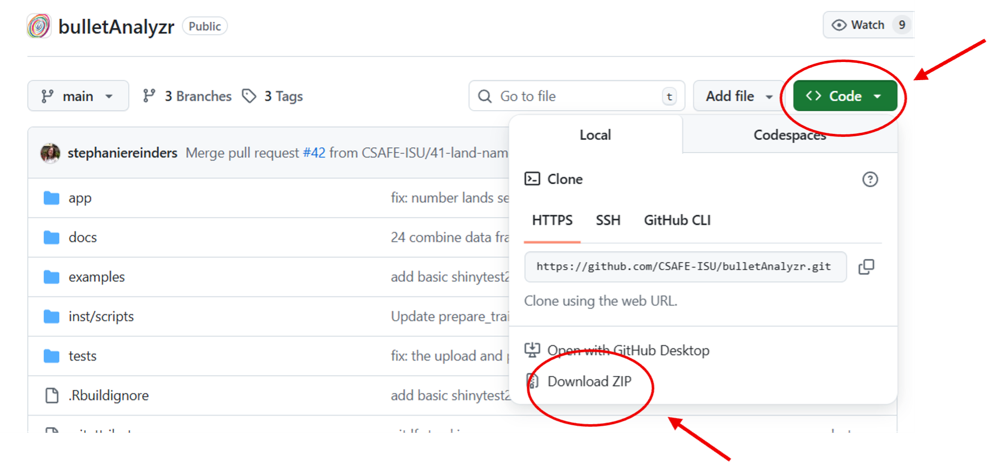
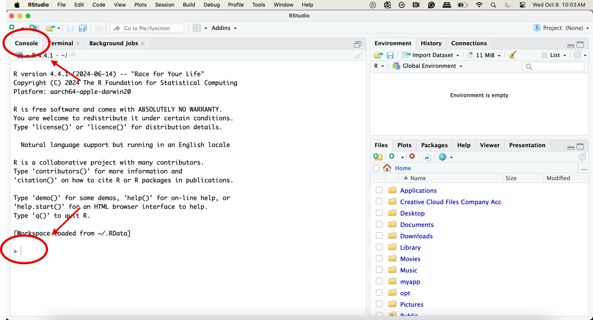
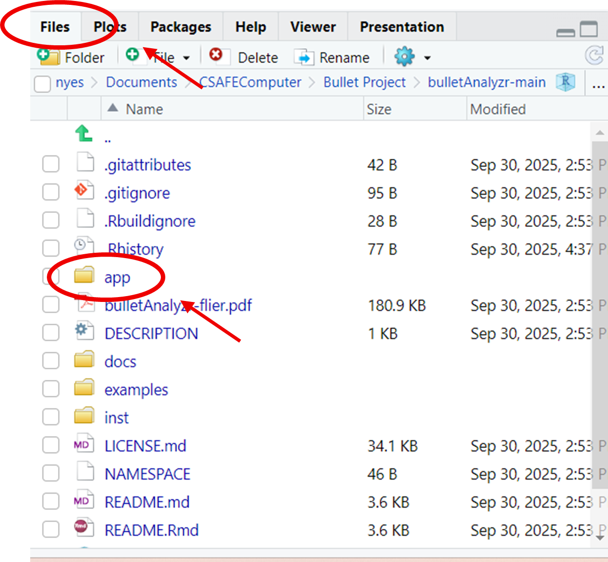
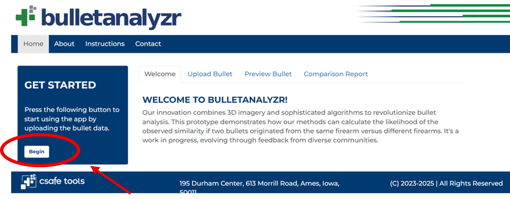
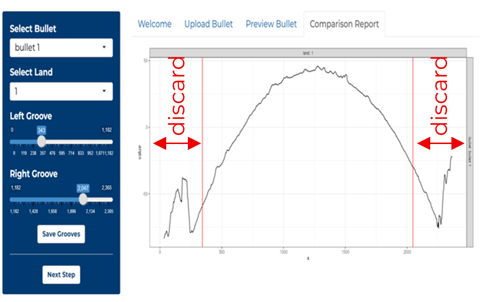
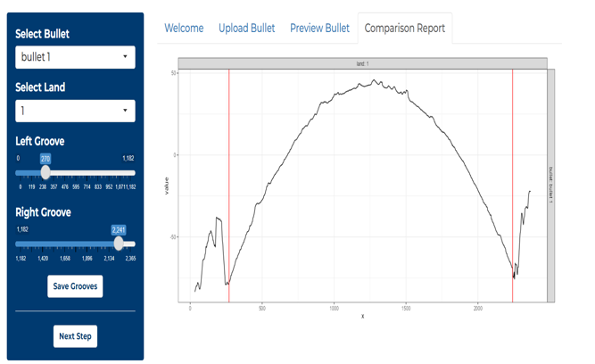
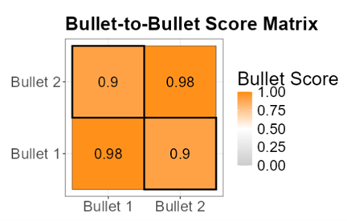
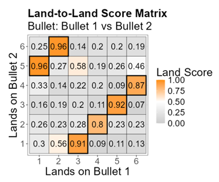
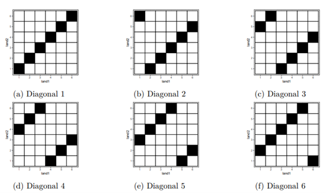
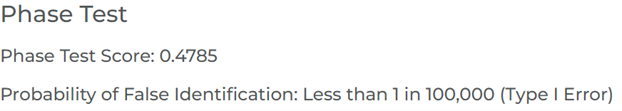

```{r global-options, include = FALSE}
knitr::opts_chunk$set( 
  collapse = TRUE,
  comment = "#>",
  fig.align = 'center',   # Centers the figure and caption
  out.width = '75%'       # Sets the display width for all included images
)
```

## Installing Required Software

You will need to install **R**, **RStudio**, `BulletAnalyzr`, and supporting R packages.

### Estimated Time: **20–30 minutes**

### Install R and RStudio

* **Install R:** Download and install R from the Comprehensive R Archive Network (CRAN):
    * <https://cran.r-project.org/>
* **Install RStudio:** Download and install the free **RStudio Desktop** Integrated Development Environment (IDE), which greatly simplifies working with R:
    * <https://posit.co/download/rstudio-desktop/>


### Download the `bulletAnalyzr` Package

The next step is to obtain the source code for the `bulletAnalyzr` package from GitHub.

1.  **Navigate to the GitHub Repository:**
    * Go to the package's repository at <https://github.com/CSAFE-ISU/bulletAnalyzr>.
2.  **Download the ZIP File:**
    * Click the green **`< > Code`** button and select **`Download ZIP`**. (See Figure 1 for visual guidance.)
    
    ```{r,  echo=FALSE, fig.cap="**Figure 1:** Location of the 'Code' button and 'Download ZIP' option on the GitHub repository page."}
     
    ```
    
3.  **Unzip the Folder:**
    * Double-click on the downloaded ZIP file to extract its contents.
    * You may save the unzipped folder anywhere on your computer.
    * By default, the folder will be named **`bulletAnalyzr-main`**. You may rename this folder if you wish.
    

---

## Install R Packages in RStudio

This section details how to install all necessary packages from CRAN and GitHub using RStudio.


### Estimated Time: **45–50 minutes**

1.  **Open RStudio.**

2.  **Navigate to the RStudio Console.** (Figure 2)
    ```{r,  echo=FALSE, fig.cap="**Figure 2:** The Console in RStudio."}
     
    ```
    
3.  **Copy and paste** the following lines of code into the **Console** after the `>` symbol. (Figure 2)

```{r package-installation, eval=FALSE}
# Install packages from CRAN
cran_packages <- c("bsicons", "bslib", "curl", "devtools", "dplyr", "DT", "ggplot2", "pagedown", 
                   "randomForest", "rgl", "sessioninfo", "shiny","shinyBS", 
                   "shinycssloaders", "shinyjs")
for (pkg in cran_packages) {
  install.packages(pkg)
}

# Install packages from GitHub
github_packages <- c("heike/bulletxtrctr", "heike/x3ptools")
for (pkg in github_github_packages) {
  devtools::install_github(pkg)
}
```

    *Note: Running this code will install a large number of packages, which may take some time.*

---

## Walkthrough of `BulletAnalyzr`

`BulletAnalyzr` includes 3D scans from the **Hamby-Brundage bullet set \#44** provided by CSAFE so you can practice the workflow.

### Total Estimated Time: **15–20 minutes**

### A. Launch BulletAnalyzr

1.  **Navigate** to the **`BulletAnalyzr` folder** that you downloaded and unzipped during installation.

2.  **Double-click** on the file named **`rstudio.Rproj`** to open `BulletAnalyzr` in RStudio.

3.  **Alternative Launch:** If the previous step did not work:

      * Open RStudio
      * Click **Open Project** in the top-right corner.
      * Select the **`bulletAnalyzr`** folder that you unzipped during installation.
      * Select the RStudio project File named **`rstudio.Rproj`**.

4.  Once `BulletAnalyzr` is open, navigate to the **Files** tab in the bottom right hand corner and double-click the **`app`** folder to open it. (Figure 3)
    ```{r,  echo=FALSE, fig.cap="**Figure 3:** Find the Files tab in RStudio. Then open the app folder."}
     
    ```
   
5.  Click the **`server.R`** file to open it in RStudio’s main window. (Figure 4)
6.  Click **Run App** in the main window to launch the app. (Figure 4)
    ```{r,  echo=FALSE, fig.cap="**Figure 4:** Click Run App in the server.R file to launch BulletAnalyzr."}
    knitr::include_graphics("Images/fig4.png") 
    ```
   
7.  Click **Begin** on the `BulletAnalyzr` home screen. (Figure 5)

    ```{r,  echo=FALSE, fig.cap="**Figure 5:** Click Begin on the BulletAnalyzr home page to get started."}
     
    ```
   
### B. Upload the Bullets

#### **Upload the first bullet.**

1.  Click **Browse** and navigate to the **`BulletAnalyzr`** folder. Then go to **`examples`** \> **`Hamby-44`** \> **`Barrel 1`** \> **`Bullet 1`**.

2.  Select all 6 files in this folder. Each **`.x3p`** file is an image of a bullet land engraved area. (Figure 6)

3.  Give the bullet a name (e.g., **`Bullet 1`**). (Figure 6)

4.  Click **Add it to the Comparison List**. (Figure 6)

5.  A **preview of each land** is shown in the main window. Rotate and zoom the lands for different perspectives. (Figure 6)

    ```{r,  echo=FALSE, fig.cap="**Figure 6:** Click Browse to upload the scans from the first bullet. Give the bullet a name. Click Add Bullet to Comparison List."}
    knitr::include_graphics("Images/fig6.png") 
    ```
   

#### **Upload the second bullet.**

  * Repeat the same process for the **`Bullet 2`** images: **`examples/Hamby-44/barrel 1/Bullet 2`**.


### C. Adjust the Crosscut Locations

`BulletAnalyzr` attempts to identify suitable crosscut locations. The crosscuts are displayed as **light grey lines** on the lands.

  * **Adjust the crosscuts for Bullet 1.**
      * Select **`Bullet 1`** from the drop-down menu if it isn’t already selected.
      * Use the **sliders** to adjust the crosscuts if needed.
      * Click **Finalize Crosscut** when satisfied.
  * **Adjust the crosscuts for Bullet 2.**
      * Select **`Bullet 2`** from the drop-down menu.
      * Use the **sliders** to adjust the crosscuts if needed.
      * Click **Finalize Crosscut** when satisfied.
  * When both bullets are ready, click **Compare Bullets**.


### D. Adjust the Groove Placements

In order to capture the full land, the scans also contain parts of the grooves. `BulletAnalyzr` needs to remove the grooves before further processing. The app attempts to locate the grooves on the crosscut profile, but manual adjustment is sometimes required.

#### **Adjust the groove on land 1 of Bullet 1.**

1.  Select **`Bullet 1`** and **`Land 1`** from the drop-down menus. (Figure 7)
    ```{r,  echo=FALSE, fig.cap="**Figure 7:** The profile plot of Bullet 1 Land 1. The red lines indicate the current location of the grooves. The profile between each groove and the side of the plot will be discarded."}
     
    ```
   
2.  The vertical **red lines** on the crosscut profile plot indicate the left and right groove locations. Everything to the left of the left groove line and everything to the right of the right groove line will be discarded.

3.  Adjust the groove locations using the **slider bars** to keep as much of the land as possible.
    ```{r,  echo=FALSE, fig.cap="**Figure 8:** The profile plot of Bullet 1 Land 1 after the grooves are moved."}
     
    ```
   
4.  Click **Save Grooves** when satisfied.

  * **Repeat for all lands on both bullets.**
  * Once grooves are defined, click **Next Step**.

---
## Run the Analysis and View Results

Click **Download Report** to download a copy of the report.

Behind the scenes, BulletAnalyzr extracts signals from the lands. Each signal from Bullet 1 is compared to each signal from Bullet 2 by measuring features such as consecutive matching straie.

### A. Bullet-to-Bullet Score

The **bullet-to-bullet score matrix** shows the similarity score between Bullet 1 and Bullet 2. Scores range from 0 to 1, with 0 indicating no similarity and 1 indicating perfect similarity. Bullets 1 and 2 have a similarity score of 0.90, indicating similarity. The phase test score and the probability of false identification give more information about the interpretation of the similarity score.

```{r fig9-b-b, echo=FALSE, fig.align='center', out.width='75%', fig.cap="**Figure 9:** Overall similarity score for the two comparison bullets (Bullet-to-Bullet Score Matrix)."}

```


### B. Land-to-Land Comparison and Phases

`BulletAnalyzr` compares each land on Bullet 1 witheach land on Bullet 2to measure their similarity. The resulting **land-to-land score matrix** displays the similarity scores for every possible land pair.

Each unique alignment of lands between the two bullets is referred to as a **phase**. For bullets with six lands, there are six possible phases (Figure 11). The selection of these phases is called **phase-selection grouping**. In the land-to-land matrix, the cells corresponding to the highest average similarity score are outlined with dark boxes and referred to as the **in-phase**. The other possible phase alignments are called **off-phases**.

```{r fig10-l-l, echo=FALSE, fig.align='center', out.width='75%', fig.cap="**Figure 10:** The land-to-land score matrix displaying similarity scores for all land pairings between Bullet 1 and Bullet 2."}

```


```{r phases, echo=FALSE, fig.align='center', out.width='75%', fig.cap="**Figure 11:** Possible phase alignments."}

```


### C. Statistical Test (The Phase Test)

To determine whether two bullets originate from the same or different sources, we perform a t-test. The null hypothesis assumes **no difference** between the mean similarity scores of matching and non-matching lands. The alternative hypothesis states that the mean similarity score for matching lands is **greater** than that for non-matching lands. In other words, matching lands from the same bullet or firearm are expected to show higher similarity values than non-matching lands.

However, selecting a specific phase introduces selection bias. To address this issue, `BulletAnalyzr` implements a new statistical approach called the phase test, designed to correct the inflation of Type I errors that occur when traditional t-tests are applied under phase-selection grouping. The phase test employs a new test statistic based on order statistics from the six-phase means. Specifically, it measures the difference between the phase with the **highest** average similarity score and the phase with the **3rd highest** average similarity score. This value is defined as the **phase test score**.

The phase test score and the probability of false identification can be found below. For the example bullets, the probability of a false identification is less than 1 in 10 million.

```{r fig12-phasetest, echo=FALSE, fig.align='center', out.width='75%', fig.cap="**Figure 12:** The phase test score and the probability of false identification."}
